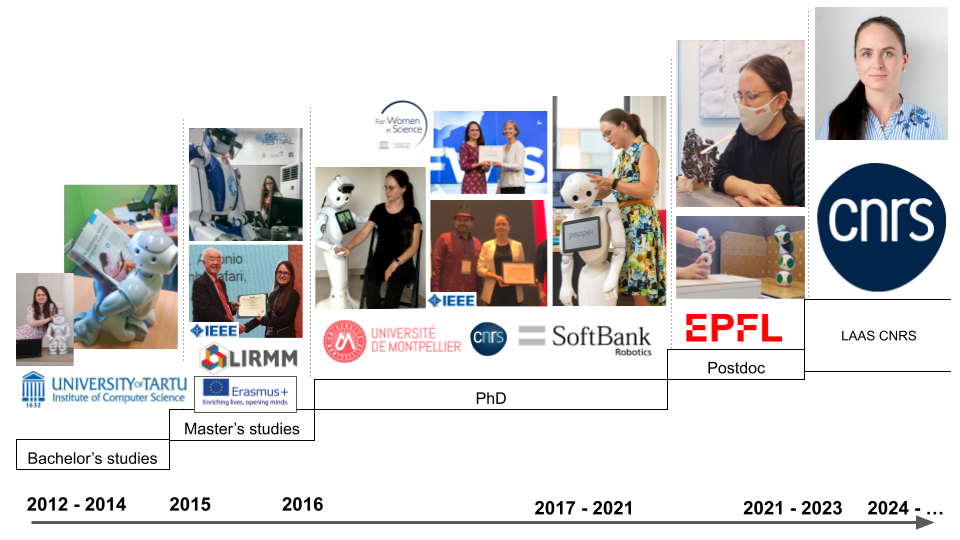

# Welcome to my personal webpage

My name is Anastasia Bolotnikova. 

I am a robotics researcher with a background in computer science (speciality in machine learning and data mining).

In the past 10 years, I have worked with 7 different robotics platforms in 3 different countries (Estonia, France, Switzerland).

I like doing research in robot motion planning and control, perception for robotics closed-loop control and human-robot interaction.

## My professional path in a nutshell

## Some of my works

### Task-Space Control Interface for SoftBank Humanoid Robots and its HRI Applications

[Project Code](https://github.com/jrl-umi3218/mc_naoqi) | [Video](https://www.youtube.com/watch?v=qzEnCGlT93s) | [Publication](https://hal.science/hal-02919367v2/document) 

### Multi-Contact Planning on Humans for Physical Assistance by Humanoid

<object data="doc/RA-L2020_Bolotnikova_et_al.pdf" type="application/pdf" width="700px" height="700px">
	<embed src="doc/RA-L2020_Bolotnikova_et_al.pdf">
    	
<a href="doc/RA-L2020_Bolotnikova_et_al.pdf">RA-L 2019</a>

</object>

### Contact observer based on tracking joint position discrepancies

<object data="doc/Ro-Man2018_Bolotnikova_et_al.pdf" type="application/pdf" width="700px" height="700px">
	<embed src="doc/Ro-Man2018_Bolotnikova_et_al.pdf">
    	
<a href="doc/Ro-Man2018_Bolotnikova_et_al.pdf">RO-MAN 2018</a>

</object>

### Humanoid robot in aircraft manufacturing

<object data="doc/CASE17_0096_FI.pdf" type="application/pdf" width="700px" height="700px">
	<embed src="doc/CASE17_0096_FI.pdf">
    	
<a href="doc/CASE17_0096_FI.pdf">CASE 2017</a>

</object>

## My Curriculum Vitae

<object data="doc/CV.pdf" type="application/pdf" width="700px" height="700px">
	<embed src="doc/CV.pdf">
    	
<a href="doc/CV.pdf">Curriculum Vitae</a>

	</embed>
</object>
